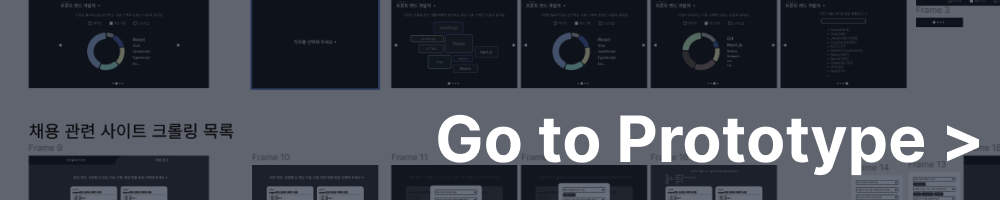
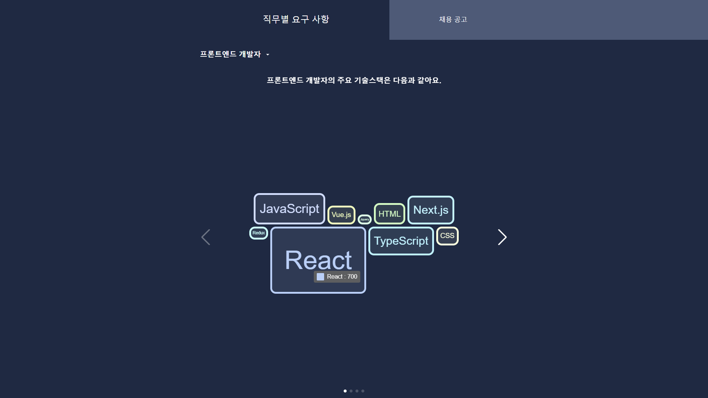
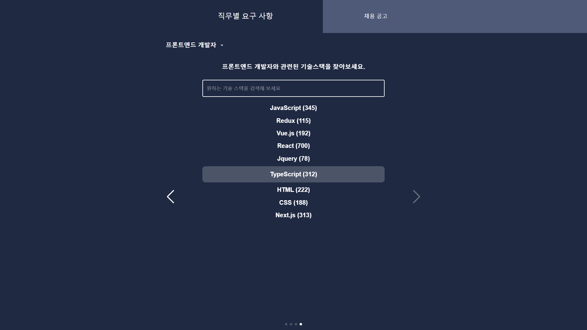
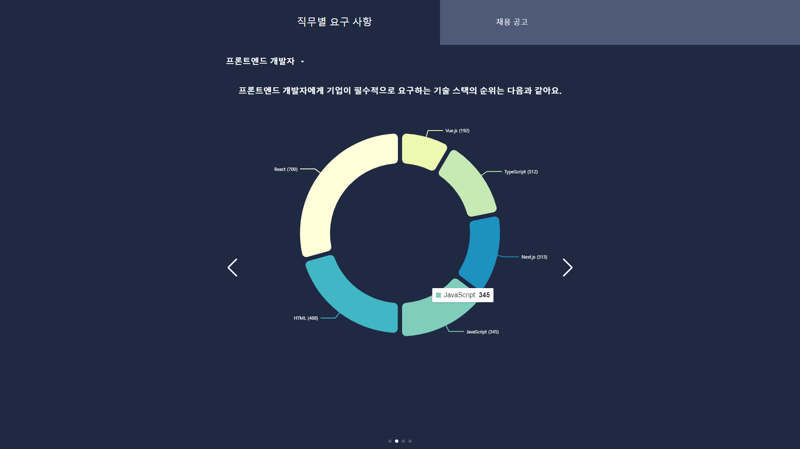
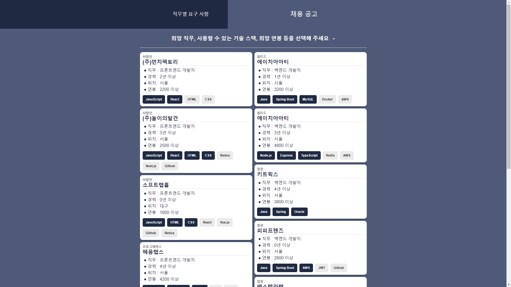
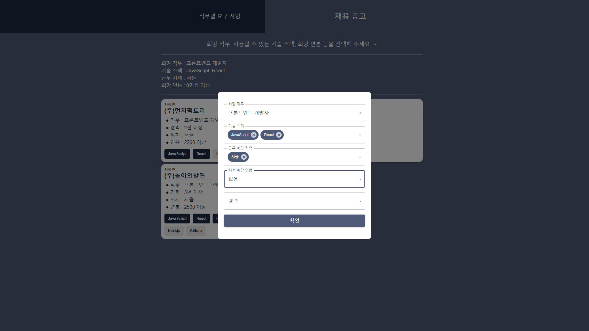

## 발표용 프로토타입

## 팀원

| <a href="https://github.com/Tentennball">이태훈</a>                                                          | <a href="https://github.com/hotteok00">이호준</a>                                                           | <a href="https://github.com/minganin99">정민관</a>                                                           | <a href="https://github.com/ches0703">최은성</a>                                                           |
| ------------------------------------------------------------------------------------------------------------ | ----------------------------------------------------------------------------------------------------------- | ------------------------------------------------------------------------------------------------------------ | ---------------------------------------------------------------------------------------------------------- |
|  |  |  |  |

## 제시 주제

1. 산업용 7세그먼트 디스플레이 표시값 데이터 자동 인식/수집 서비스 구현(딥러닝)
2. **크롤링을 이용한 개발자 취업 요구사항 분석**
3. 여러 개의 게임을 합친 미니게임 종합 컨셉 기획
4. Toy Gon을 활용한 VR게임 기획

## 아이디어 개요

> IT관련 종사자 또는 종사예정자, 취업 준비생에게 직무별 관련 기술 스택과, 취업공고글을 취합하여 사용자에세 적절한 취업 공고글을 필터링 해주는 웹사이트

## 주요 기능

1. 잡코리아, 사람인, AI커리어, 원티드, 잡플래닛 등의 취업 사이트에 게시된 취업 공고에서 자격요건이나 우대사항 중 키워드를 추출한다. 이를 통해 사용자가 원하는 직무에서 주로 사용하는 기술스택 통계를 제시한다.

|  |  |  |
| -------------------------------------- | -------------------------------------- | -------------------------------------- |

2. 잡코리아, 사람인, AI커리어, 원티드, 잡플래닛 등의 취업 사이트에 게시된 취업 공고를 취합하여, 사용자의 능력이나 요구사항에 적합하게 필터링하여 공고글 목록을
   제시한다.

|  |  |
| -------------------------------------- | -------------------------------------- |

## 특징 및 장점

1. 취업 사이트의 공고글을 많이 접하고 찾아보아야 직무별 요구사항을 정리할 수 있지만, 해당 아이디어를 통해 직무별 요구사항을 확인 할 수 있다.
2. 여러 취업 사이트의 취업 공고글을 취합하기 때문에 하나의 사이트에서 여러 사이트에 대한 정보를 확인 할 수 있으므로 공고글을 찾는 수고를 덜어준다.
3. 사용자가 습득한 기술스택에 맞는 공고글을 제시하여 적절한 공고글을 찾는데에
   도움을 준다

## 기타 사항

- 프로토타입 제작 기술 스택
  

    
    
    
    
    
    
    

  

- <a href="./Doc/2024 산업체 문제해결 아이디어 경진대회 발표 ppt.pdf">발표 PPT</a>
